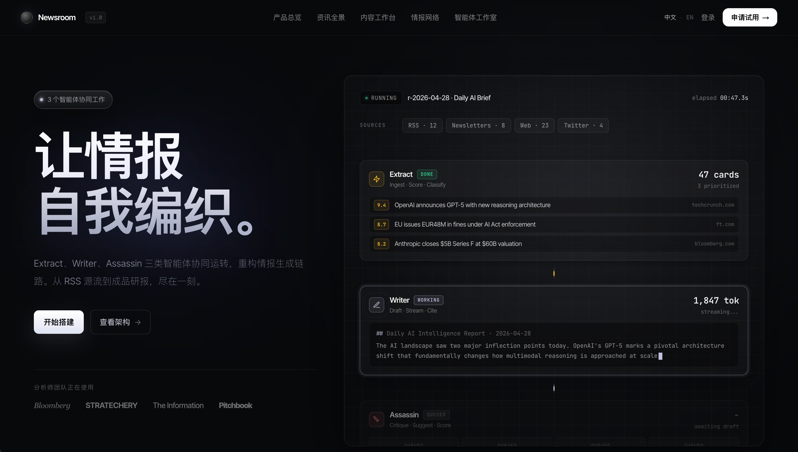
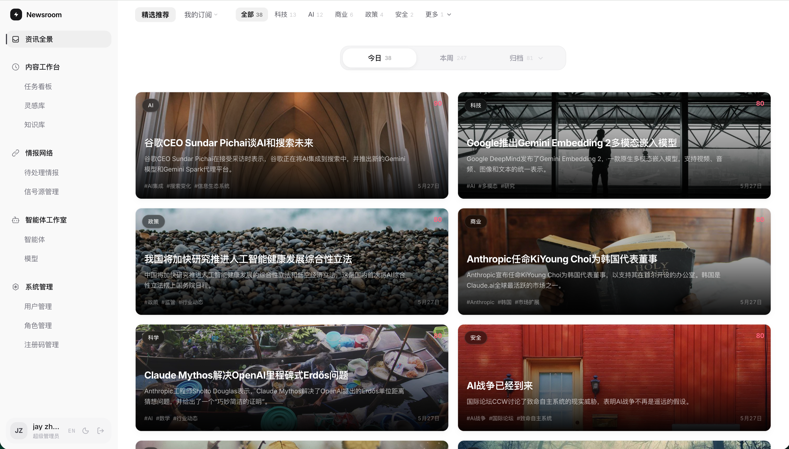
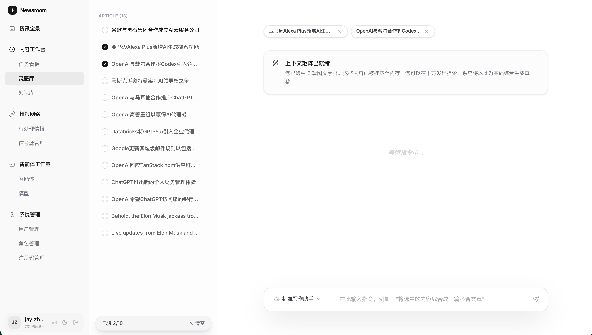
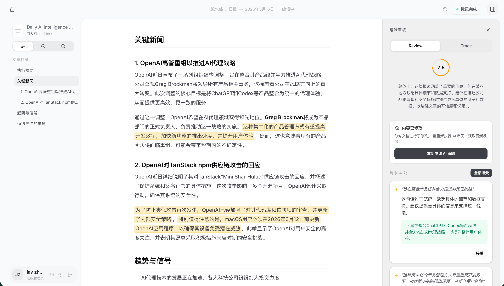

# AI Newsroom

AI Newsroom 是一套面向新闻编辑和内容团队的 AI 内容生产工作台。它把新闻源抓取、素材处理、智能卡片、草稿生成、审稿改写、视频监控、图片生成和权限管理串成一条可配置的生产流程，适合在本地或私有环境里搭建一套可控的内容系统。

## 官方部署界面

注册码如下，每个注册码支持 50 个用户：

- `NR-3FA0-015E-502C`
- `NR-98BA-B7BC-1042`
- `NR-9E04-CB1B-CA02`

访问 [https://newsroom.vedegeek.com](https://newsroom.vedegeek.com) 体验官方部署版本。

## 界面展示

### 官方首页与登录入口



### 核心工作台

| 资讯全景 | 灵感库 |
|---|---|
|  |  |
| 汇总推荐内容、分类筛选和评分排序，帮助编辑快速发现高价值选题。 | 从资讯素材中挑选内容，形成上下文矩阵，为后续写作提供输入。 |

### 在线编辑与 AI 审稿



在编辑器中完成日报、研报或文章草稿，并通过侧边栏查看审稿评分、修改建议和可接受的改写结果。

English documentation: [README.en.md](README.en.md)

## 主要功能

- **新闻源抓取**：基于 RSS / RSSHub 拉取内容，支持定时抓取和手动触发。
- **智能卡片**：把原始文章交给 AI 处理，生成结构化摘要，方便编辑筛选和复用。
- **写作与审稿流程**：支持草稿生成、AssassinAgent 审稿、差异对比和二次改写。
- **视频监控**：监控 YouTube、B 站等视频平台，自动发现新内容并进入分析流程。
- **素材库与灵感库**：归档参考资料、灵感片段和可复用素材。
- **Agent 配置**：支持按 Agent 配置模型、API Key，并通过 SSE 流式输出结果。
- **插件系统**：支持从 GitHub 安装第三方插件并绑定至 Agent，每个用户独立配置 GitHub Token 以避免 API 速率限制。
- **图片生成**：可为卡片和任务生成封面图或配图。
- **权限与系统管理**：支持用户、角色、权限和配额管理，并可通过 Clerk 同步用户。

## 目录结构

```text
NewsRoom/
├── ai-newsroom/                # 应用源码
│   ├── backend/                # FastAPI + Celery + SQLAlchemy 后端
│   ├── frontend/               # Next.js 16 + React 19 前端
│   ├── start-backend.sh        # 本地后端启动脚本
│   ├── start-celery.sh         # 本地 Celery Worker 启动脚本
│   ├── start-frontend.sh       # 本地前端启动脚本
│   └── docker-local.sh         # 本地镜像构建脚本
└── docker/
    ├── docker-compose.yml      # 基础设施：PostgreSQL、Redis、MinIO、RSSHub
    ├── rsshub.env.example      # RSSHub Cookie 配置模板
    └── ai-newsroom/
        ├── docker-compose.yml  # 应用服务：backend、celery、frontend、nginx
        ├── .env.example        # Compose / 镜像 / 端口配置模板
        ├── config/             # 后端运行时配置 backend.env
        └── nginx/default.conf  # Nginx 反向代理配置
```

## 技术栈

| 层级 | 技术 |
|---|---|
| 前端 | Next.js 16、React 19、TypeScript、Tailwind CSS 4、Zustand、SWR |
| 后端 | FastAPI、SQLAlchemy async、Pydantic v2 |
| 任务队列 | Celery + Redis |
| 调度器 | APScheduler，运行在 API 进程内 |
| 数据库 | PostgreSQL 15 |
| 对象存储 | MinIO，兼容 S3 |
| RSS 源 | RSSHub |
| AI 模型 | Google Gemini、通义千问 / DashScope、DeepSeek、OpenAI 兼容接口 |
| 网页与视频提取 | Playwright、yt-dlp、Jina Reader 可选 |
| 认证 | 本地账号 + 可选 Clerk JWT / Webhook 同步 |

## 本地开发

### 环境要求

- Python 3.11+
- Node.js 20+
- `uv`，用于创建后端虚拟环境并安装 Python 依赖
- Docker 和 Docker Compose，用于启动 PostgreSQL、Redis、MinIO、RSSHub

### 1. 启动基础设施

```bash
cd docker
cp rsshub.env.example rsshub.env
docker network create metalm-base-net 2>/dev/null || true
docker compose up -d
```

这会启动 PostgreSQL、Redis、MinIO 和 RSSHub：

| 服务 | 本地端口 |
|---|---|
| PostgreSQL | `23012` |
| Redis | `23013` |
| MinIO | `23016` |
| RSSHub | `23017` |

> `docker/rsshub.env` 只用于本地或部署环境，已被 `.gitignore` 忽略。请不要把真实 Cookie 提交到仓库。

### 2. 配置后端环境变量

本地开发可以从模板开始：

```bash
cp ai-newsroom/backend/.env.example ai-newsroom/backend/.env
```

按需填入 Clerk、模型密钥或其他本地配置。`start-backend.sh` 会读取 `ai-newsroom/backend/.env`。

### 3. 启动后端 API

```bash
cd ai-newsroom
bash start-backend.sh
```

脚本会在缺少虚拟环境时使用 `uv` 创建 `.venv` 并安装依赖。后端默认运行在 `http://localhost:8000`。健康检查：

```bash
curl http://localhost:8000/api/health
```

### 4. 启动 Celery Worker

```bash
bash start-celery.sh
```

许多抓取、处理、视频分析和生成任务依赖 Celery。只启动后端 API 时，接口可以访问，但异步任务可能停留在排队状态。

### 5. 启动前端

```bash
bash start-frontend.sh
```

脚本会在缺少 `node_modules` 时运行 `npm ci`。前端默认运行在 `http://localhost:3000`。

## 后端环境变量

后端按下面顺序读取配置，前面的优先级更高：

1. `AI_NEWSROOM_SETTINGS_FILE` 指定的文件
2. `/run/config/backend.env`，Docker 挂载路径
3. `ai-newsroom/.env`
4. `ai-newsroom/backend/.env`

常用配置：

| 变量 | 默认值 | 说明 |
|---|---|---|
| `DATABASE_URL` | `postgresql+asyncpg://...@localhost:23012/metalm` | 异步数据库连接 |
| `DATABASE_URL_SYNC` | `postgresql+psycopg://...@localhost:23012/metalm` | 同步数据库连接 |
| `REDIS_URL` | `redis://:metalm2024@localhost:23013/0` | Celery 与任务管理使用的 Redis |
| `GEMINI_API_KEY` | 空 | Google Gemini API Key |
| `QWEN_API_KEY` | 空 | 通义千问 / DashScope API Key |
| `JINA_API_KEY` | 空 | 可选，用于增强网页抽取 |
| `MINIO_ENDPOINT` | `http://127.0.0.1:23016` | MinIO 地址 |
| `MINIO_ACCESS_KEY` | `minioadmin` | MinIO Access Key，本地默认值仅用于开发 |
| `MINIO_SECRET_KEY` | `minioadmin` | MinIO Secret Key，本地默认值仅用于开发 |
| `MINIO_BUCKET` | `newsroom-images` | MinIO Bucket |
| `RSSHUB_BASE_URL` | `http://localhost:23017` | RSSHub 地址 |
| `AUTH_SECRET_KEY` | `ai-newsroom-dev-secret` | JWT 签名密钥，生产环境必须更换 |
| `CREDENTIAL_ENCRYPTION_SECRET` | 空 | 平台 Cookie 加密密钥，部署后应保持稳定 |
| `CORS_ORIGINS` | `http://localhost:3000` | 允许跨域的前端来源 |
| `ENABLE_SCHEDULER` | `true` | 是否在 API 进程中运行 APScheduler |
| `SCRAPE_CRON` | `0 */4 * * *` | 新闻源抓取计划，默认每 4 小时 |
| `CLERK_ISSUER` | 空 | 可选，Clerk JWT issuer |
| `CLERK_JWKS_URL` | 空 | 可选，显式 Clerk JWKS URL；为空时由 `CLERK_ISSUER` 推导 |
| `CLERK_SECRET_KEY` | 空 | 可选，Clerk Backend API secret key |
| `CLERK_WEBHOOK_SECRET` | 空 | 可选，Clerk/Svix webhook signing secret |
| `CLERK_ADMIN_EMAILS` | 空 | 逗号分隔的管理员邮箱白名单，命中后自动分配 `super_admin` |
| `NEWSROOM_TENANT_ROOT` | `/var/lib/newsroom` | 用户数据存储根目录（插件、工作空间、运行记录等） |
| `GITHUB_TOKEN` | 空 | 可选，全局 GitHub PAT 回退值；优先使用用户个人 Token |

`GEMINI_API_KEY` 和 `QWEN_API_KEY` 不要求在启动时配置。更推荐在前端 Agent 页面里按 Agent 单独配置模型和密钥。

## Clerk Webhook 与管理员初始化

后端提供 Clerk webhook endpoint：

```text
POST /api/webhooks/clerk
```

本地测试时可以用 Cloudflare Tunnel、ngrok 或其他 HTTPS 隧道暴露后端，例如：

```bash
cloudflared tunnel --url http://localhost:8000 run dev-tunnel
```

Clerk Dashboard 里配置的 endpoint 应指向：

```text
https://<your-domain>/api/webhooks/clerk
```

建议勾选事件：

- `user.created`
- `user.updated`
- `user.deleted`

同步行为：

- `user.created` / `user.updated` 会创建或更新本地用户。
- `user.deleted` 会将本地用户标记为 inactive，不会物理删除。
- `CLERK_ADMIN_EMAILS` 中的邮箱会自动获得 `super_admin` 角色，从而显示系统管理入口。
- 其他 Clerk 事件会返回成功但被忽略。

## 注册码注册与 Clerk 邮箱验证码

前端注册页使用自定义 Clerk 邮箱密码流程：

1. 用户输入邮箱、用户名、密码、注册码和申请理由。
2. 后端 `POST /api/auth/activation-code/approve` 验证注册码并记录申请。
3. 前端调用 Clerk 注册并发送邮箱验证码（email code）。
4. 用户在页面内输入验证码完成注册。
5. Clerk webhook 或登录补偿会同步本地用户。

注册码只限制本产品注册页的自助入口，不依赖 Clerk Allowlist，也不是身份层硬限制。如果用户已经通过 Clerk Dashboard、其他入口或未来开放注册创建成功，后端仍会信任 Clerk 并同步本地用户。

Clerk Dashboard 需要确认：

- 关闭 Waitlist mode 和 Restricted mode，保持普通注册流程可用。
- 启用邮箱注册、邮箱登录和密码注册。
- Verify at sign-up 使用 Email verification code / OTP，不使用 email link 作为主流程。
- Webhook 继续订阅 `user.created`、`user.updated`、`user.deleted`。

如果使用 Docker 部署，请从示例文件创建并填充：

```bash
cp docker/ai-newsroom/.env.example docker/ai-newsroom/.env
cp docker/ai-newsroom/config/backend.env.example docker/ai-newsroom/config/backend.env
```

并把本地 `CLERK_SECRET_KEY`、`CLERK_WEBHOOK_SECRET`、`CLERK_ISSUER` / `CLERK_JWKS_URL` 与前端 `AI_NEWSROOM_NEXT_PUBLIC_CLERK_PUBLISHABLE_KEY` 同步到对应文件。

## 前端环境变量

在 `ai-newsroom/frontend/` 下创建 `.env.local`，可从模板开始：

```bash
cp ai-newsroom/frontend/.env.local.example ai-newsroom/frontend/.env.local
```

常用配置：

| 变量 | 默认值 | 说明 |
|---|---|---|
| `NEXT_PUBLIC_API_URL` | `http://localhost:8000` | 浏览器端 API 地址 |
| `INTERNAL_API_URL` | `http://localhost:8000` | 服务端 / SSR 使用的后端地址 |
| `NEXT_PUBLIC_CLERK_PUBLISHABLE_KEY` | 空 | Clerk Publishable Key，不配置则跳过 Clerk 认证 |
| `CLERK_SECRET_KEY` | 空 | Clerk Secret Key，服务端验证用 |
| `NEXT_PUBLIC_CLERK_SIGN_IN_URL` | `/sign-in` | Clerk 登录页路由 |
| `NEXT_PUBLIC_CLERK_SIGN_UP_URL` | `/sign-up` | Clerk 注册页路由 |
| `NEXT_PUBLIC_CLERK_SIGN_IN_FORCE_REDIRECT_URL` | `/` | 登录后跳转地址 |
| `NEXT_PUBLIC_CLERK_SIGN_UP_FORCE_REDIRECT_URL` | `/` | 注册后跳转地址 |

如果不配置 API URL，前端会默认请求 `localhost:8000`。在 Nginx 部署中，浏览器请求会走同源 `/api/*` 路径，不需要硬编码后端域名。

如果 `NEXT_PUBLIC_CLERK_PUBLISHABLE_KEY` 为空，前端会跳过 Clerk 认证流程（适用于不需要认证的本地开发或 Docker 构建场景）。Docker 构建时需通过 `docker/ai-newsroom/.env` 中的 `AI_NEWSROOM_NEXT_PUBLIC_CLERK_PUBLISHABLE_KEY` 注入。

## Docker 部署

部署分为两层：

- **基础设施**：`docker/docker-compose.yml`，包含 PostgreSQL、Redis、MinIO、RSSHub。
- **应用服务**：`docker/ai-newsroom/docker-compose.yml`，包含 backend、3 个 Celery Worker、frontend、nginx。

首次启动示例：

```bash
# 1. 启动基础设施
cd docker
cp rsshub.env.example rsshub.env
docker network create metalm-base-net 2>/dev/null || true
docker compose up -d

# 2. 构建应用镜像，脚本会自动识别 arm64 / amd64
cd ../ai-newsroom
./docker-local.sh local

# 3. 准备应用配置
cp ../docker/ai-newsroom/.env.example ../docker/ai-newsroom/.env
cp ../docker/ai-newsroom/config/backend.env.example ../docker/ai-newsroom/config/backend.env
# 编辑 .env，填入前端公开配置，例如 AI_NEWSROOM_NEXT_PUBLIC_CLERK_PUBLISHABLE_KEY
# 编辑 backend.env，填入真实 API Key、数据库密码、认证密钥和 Clerk 后端配置

# 4. 启动应用服务
docker compose --env-file ../docker/ai-newsroom/.env \
  -f ../docker/ai-newsroom/docker-compose.yml up -d
```

访问入口：

| 服务 | 地址 |
|---|---|
| Nginx 统一入口 | `http://localhost:8080` |
| 前端直连 | `http://localhost:3000` |
| 后端 API 直连 | `http://localhost:8000` |

生产环境的 Celery 按任务类型拆分为 3 个独立 Worker：

| Worker | 队列 | 默认并发 | 职责 |
|---|---|---|---|
| `celery-fast` | `newsroom_fast`、`newsroom_default`、`celery` | 2 | RSS 抓取、手动抓取、监控发现等快速 I/O 任务 |
| `celery-ai` | `newsroom_ai` | 1 | 文章处理、AI 审稿、视频元数据分析、插件安装等 LLM 推理任务 |
| `celery-video` | `newsroom_video` | 1 | 完整视频分析：下载音频、转写、LLM 分析、保存卡片 |

本地开发使用 `start-celery.sh` 启动单个合并 Worker，同时监听所有队列。

构建选项：

```bash
# 构建当前机器架构的镜像
./docker-local.sh local

# 导出 linux/amd64 + linux/arm64 多架构 OCI 包，不推送
./docker-local.sh archive
# 输出目录：ai-newsroom/dist/docker/
```

配置文件分工：

| 文件 | 用途 |
|---|---|
| `docker/ai-newsroom/.env` | Compose 层配置：端口、镜像名、构建镜像源、NPM / pip / apt 源、前端公开 Clerk 配置 |
| `docker/ai-newsroom/config/backend.env` | 后端运行时配置：数据库、Redis、MinIO、模型密钥、认证密钥、Clerk secret / webhook 配置 |
| `docker/rsshub.env` | RSSHub Cookie 等本地运行时配置，不应提交 |
| `docker/rsshub.env.example` | 可提交的 RSSHub 配置模板 |

生产环境必须更换所有默认密钥和默认密码，尤其是 `AUTH_SECRET_KEY`、`DEFAULT_ADMIN_PASSWORD`、数据库、Redis、MinIO、Clerk 和模型 API Key。

再次执行 `docker compose up -d` 不会清空已有数据库。后端启动时会创建缺失的表，并对已知的缺失字段做轻量补齐；已有数据会保留。只有在本地开发需要彻底重置数据、或 schema 已损坏无法启动时，才考虑删除数据库 volume。

## RSSHub Cookie 安全说明

`docker/rsshub.env` 会被 Docker Compose 通过 `env_file` 读取，可能包含 B 站、小红书等平台 Cookie。真实 Cookie 属于敏感信息，不能提交到 Git。

安全使用方式：

```bash
cd docker
cp rsshub.env.example rsshub.env
```

如果需要配置 Cookie，推荐在前端系统管理页面或视频监控的 Cookie 配置入口填写。应用会写入本地 `docker/rsshub.env`，修改后需要重启或重新创建 RSSHub 容器才会生效。

## 后端架构

```text
app/
├── main.py              # 应用初始化、中间件、路由注册
├── api/                 # HTTP 路由层，负责参数、鉴权和响应
├── services/            # 业务逻辑和跨领域协调
│   ├── worker_jobs.py   # Celery Worker 执行逻辑
│   ├── job_dispatcher.py
│   ├── monitor_service.py
│   ├── card_service.py
│   └── ...
├── workers/tasks.py     # Celery 任务外壳，包含重试策略和日志
├── model_defs/          # 按领域拆分的 SQLAlchemy 模型
├── schema_defs/         # 按领域拆分的 Pydantic Schema
├── models.py            # 模型聚合导出
├── schemas.py           # Schema 聚合导出
├── repositories/        # 单领域数据访问
└── config.py            # pydantic-settings 配置
```

Celery Worker 拆分：

```text
celery_app.py          # Celery 实例定义、路由、全局配置
workers/
├── tasks.py           # 任务外壳：重试策略、超时、日志
└── cron_jobs.py       # APScheduler 定时调度，仅 backend 进程启用
services/
└── worker_jobs.py     # 任务实际执行逻辑
```

- **celery-fast**：抓取类任务，I/O 密集但无 LLM 调用，可高并发。
- **celery-ai**：AI 推理类任务，单任务 token 和内存消耗大，并发设为 1。
- **celery-video**：视频全量分析，混合 I/O + CPU + AI 负载，超时最长（55 min），单独隔离避免阻塞。

关键流程：

- **新闻抓取**：`sources` 路由 → `job_dispatcher` → Celery 任务 → `worker_jobs` → `scraper` → `raw_articles`
- **文章处理**：`raw_articles` / `jobs` 路由 → Celery 任务 → `processor` → `processor_support` 调用 LLM → `intelligence_cards`
- **审稿改写**：`stream` 路由 → `job_dispatcher` → AssassinAgent → `drafts` / `critiques` → SSE 轮询
- **视频监控**：`monitors` 路由 → `monitor_service` → RSS 检查或 Cookie 模式 → Celery 任务 → `VideoAnalyzer` → 视频智能卡片
- **Clerk 同步**：`clerk_webhooks` 路由 → Svix 签名校验 → `clerk_sync_service` → 本地用户与角色同步
- **插件安装**：`plugins` 路由 → `plugin_service` → Celery 任务 → `plugin_source` 从 GitHub 下载快照并验证 → 绑定至 Agent

## 测试与质量检查

### 后端测试

```bash
cd ai-newsroom/backend

# 运行全部后端测试
./.venv/bin/python -m unittest discover -s tests -p 'test*.py'

# 运行指定测试模块
./.venv/bin/python -m unittest -v tests.test_external_integrations
```

测试文件位于 `ai-newsroom/backend/tests/`。仓库里还存在少量手动调试脚本或实验脚本，它们不属于正式回归测试套件。

### 前端检查

```bash
cd ai-newsroom/frontend
npm run lint
npm run build
```

当前没有单独配置前端测试 runner，也没有独立的 `typecheck` 脚本；`npm run build` 是主要的前端构建与类型检查入口。

### 建议优先补测或修复的风险点

- **Clerk 同步回归**：测试 `user.created`、`user.updated`、`user.deleted`、缺失/错误 Svix 签名、重复投递和 `CLERK_ADMIN_EMAILS` 角色分配。
- **认证与权限**：测试本地登录、Clerk JWT 登录、过期 token、inactive 用户、`system.manage` 路由保护和系统管理菜单显示。
- **Celery 依赖**：测试 Redis 或 Celery 未运行时，任务提交、状态展示和前端提示是否清晰。
- **数据库初始化**：测试空数据库和已有旧 schema 启动，确认启动时 schema 补齐逻辑不会阻塞服务。
- **前端 API 路由**：测试 `/api/generate-image`、`/api/agents/chat`、`/api/stream/...` 在本地开发和 Docker/Nginx 下的行为。
- **图片生成配额**：确认外部 provider 调用失败时是否应该消耗用户配额；当前需要产品侧明确策略。
- **Webhook 导出按钮**：编辑器里仍有模拟 webhook 推送入口，若不是正式功能，应禁用、隐藏或改成明确的“未配置”。
- **部署安全**：生产环境不能使用默认 `admin123`、`ai-newsroom-dev-secret`、`metalm2024`、`minioadmin` 等本地默认值。

## 默认账号

首次启动时会创建默认管理员账号：

| 字段 | 值 |
|---|---|
| 用户名 | `admin` |
| 邮箱 | `admin@newsroom.local` |
| 密码 | `admin123` |

生产环境请通过 `DEFAULT_ADMIN_*` 环境变量或登录后的管理界面修改默认账号信息。
